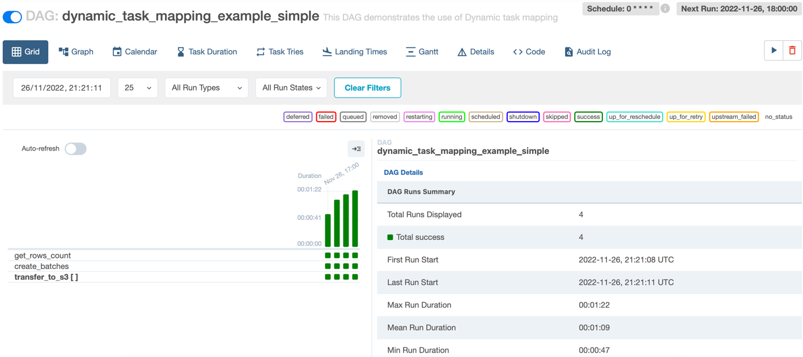

# Airflow 2.3 new features

This subdirectory covers some features introduced in Airflow
2.3. 

These include:
- [ ] Dynamic Task Mapping
- [x] Tree view replaced by Grid view (demonstrated by default)
- [x] LocalKubernetesExecutor
- [ ] Reuse of decorated tasks
- [ ] Various Minor features:
  - [ ] Store connections from JSON format

The DAG local_kubernetes_executor is excluded from
running with the other examples since it requires
a local kubernetes cluster. To run the example, read
the section LocalKubernetesExecutor and set up a local
kubernetes cluster with remote logging. 

# Dynamic task mapping
Dynamic task mapping basically refers to creating a 
number of task instances at runtime depending on the 
arguments that you pass to the expand method. 

In this example, we want to transfer the data from an
API endpoint to s3 storage. We're going to transfer
the data in batches. The number of batches is unknown
until runtime, so our DAG will define 3 operators.
It could have been accomplished with 2, but I want to
demonstrate the `BashOperator` also.
So, our operators will be:
1. BashOperator - get the number of rows from the API
2. PythonOperator - determine the batches (starts)
3. PythonOperator - transfer the data from the API 
to S3 storage.

The connection ID is defined in the docker compose
file as a connection. 

The BashOperator will push the result of the curl
command to XCOM, so we can pull the number of rows
in the next task. 
```python
get_rows_count = BashOperator(
      task_id="get_rows_count",
      bash_command="curl http://wildfires-api:8000/api/count",
      do_xcom_push=True,
  )
```
We define the next operator to create a list of batch
settings:
```python
def _create_batches(count):
    count = int(count)

    num_batches = math.ceil(count / BATCH_SIZE)
    return [{"start": i * BATCH_SIZE} for i in range(num_batches)]

create_batches = PythonOperator(
    task_id="create_batches",
    python_callable=_create_batches,
    op_kwargs={"count": "{{ ti.xcom_pull(task_ids='get_rows_count') }}"},
)
```

The operator returns a list of dictionaries. Each 
dictionary contains the `start` value for the batch. 
Now, since the function of the next operator has several
arguments, we need to map the dictionaries with these
values. Which we can do like this:
```python
def prep_arg(batch):
    return {
        "conn_id": "wildfires_api",
        "s3_conn_id": "locals3",
        "endpoint": ENDPOINT,
        **batch,
    }

op_kwargs=create_batches.output.map(prep_arg)
```

Things about map to note (taken directly from the docs):
1. the transformation is as a part of the 
“pre-processing” of the downstream task 
(transfer_to_s3 in this case), not a standalone task 
in the DAG.
2. the map function is called exactly once for each
element of the list.
3. Since the callable is executed as a part of the 
downstream task, you can use any existing techniques to 
write the task function. To mark a component as skipped, 
for example, you should raise `AirflowSkipException`.

Putting it into an operator: 
```python
transfer_to_s3 = PythonOperator.partial(
    task_id="transfer_to_s3",
    python_callable=_transfer_to_s3,
).expand(op_kwargs=create_batches.output.map(prep_arg))
```

The `partial` method crates an `OperatorPartial`. 
As the docs say: “_it only exists at DAG-parsing time; 
the only intended usage is for the user to call expand 
on it to create a MappedOperator_”.

Behind the scenes, the output property creates an 
`XComArgs` instance. This instance represents a XCom 
push from the previous operator. It is used to resolve 
the value that should be pulled from XCom. 

Using the `expand` function we tell Airflow that we
want to map the operator over the list that we pass
to it. Airflow will create an instance of a task
for each value passed to the expand function. 

And define the pipeline:
`get_rows_count >> create_batches >> transfer_to_s3`.
In some cases, Airflow can use infer the relationship
between the operators. So, you should check carefully
if this is the case for you.

When you first look at a DAG (without running it), you 
can see that there are array brackets next to the name
of the operator that is going to be dynamically mapped. 
In our example, that is the `transfer_to_s3` operator.


When you run the DAG, you should see this in the Grid
view:


You can also select the operator to view the mapped 
instances:


You can go to `localhost:9000` and login with the
minio credentials:
- user: user
- password: password

In Minio you should see the data in the bucket. Something
similar to this:


In Airflow's graph view, the graph should include a number
of mapped task instances created:


## Placing limits

The docs specify that you can limit the number of tasks
that:
1. the expand function can create, by default 1024 - 
`max_map_length`. The task will fail if there are more 
instances returned;
2. can run in parallel - this prevents a large number
of tasks from consuming all available runer slots.
The parameter is `max_active_tis_per_dag` and applies 
across all DAG runs.

## Templating
Templating in the mapping function won't work. We
couldn't have done this to get the timestamp:
```python
def prep_arg(batch):
    return {
        "conn_id": "wildfires_api",
        "s3_conn_id": "locals3",
        "endpoint": ENDPOINT,
        "timestamp": "{{ ts_nodash }}"
        **batch,
    }
```

Instead, I used the following in the `_transfer_to_s3`
function to manually render the template:
```python
timestamp = context["task"].render_template("{{ ts_nodash }}", context)
```
The docs specify that we could: _"If you want to 
interpolate values either call task.render_template 
yourself, or use interpolation:"_ . However, I'm not sure
how to use interpolation in this example. 

## Important note
I had quite the difficulty producing this example as the
task instances of the `transfer_to_s3` task kept randomly
failling with SIGTERM signalls. My first thought was that
I was running out of RAM. But simply increasing docker 
RAM resources didn't help. Then I noticed that the scheduler
was logging that it detected zombie tasks. Zombie tasks
occur when a task doesn't sent a heartbeat. I'm not
entirely sure why this happened.

It also seemed that the tasks were failing before the
response was parsed to JSON. It seemeed like parsing
the response to JSON took to many resources. 

However, I was able to make things work by using the
following approach:
1. increased docker resources: 5 CPU and 9GB RAM
2. switch to a celery executor with 3 workers
3. I also had a limit on the number of parallel copies
of the mapped task set to 4. I did this before increasing
Docker resources.

Finally, I was able to produce the images I wanted and 
confirm it was a resources related issue.

If you'd like to test it yourself using Celery,
use the following command:
```shell
make run-2.3-celery
```

The normal command:
```shell
make run-2.3
```

is configured to use the smaller dataset of 20 000 rows.
This way, you don't have to increase Docker resources.

## Further reading
You can read more about dynamic task mapping:
1. From the docs:
[here](https://airflow.apache.org/docs/apache-airflow/stable/concepts/dynamic-task-mapping.html).
2. A story I've written to compare the classical approach
to writing dynamic task mapping DAGs with Taskflow API:
[here](https://medium.com/@MarinAgli1/using-airflow-2-4-task-mapping-fe2116383999).
3. If you're interested in how dynamic task mapping works
with data-aware scheduling: [here](https://medium.com/@MarinAgli1/a-look-into-airflow-data-aware-scheduling-and-dynamic-task-mapping-8c548d4ad79).


# LocalKubernetesExecutor

The `LocalKubernetesExecutor` allows the user to 
simultaneously run both the local and kubernetes executors.
Airflow will instantiate both executors and the task
will run on one of them. The executor is chosen based on 
the task's queue. 

However, to run the kubernetes executor, we need to setup
a local kubernetes cluster.

## Running the example
First make sure that you kave kubectl, helm and kind 
installed. We'll use all three to setup the kubernetes
cluster. 

First create the cluster using the following command:
```shell
kind create cluster -n airflow
```
This will create our cluster named airflow.

Next crate the namespace and set the correct kubernetes
context:
```shell
kubectl create namespace airflow && kubectl config set-context --current --namespace airflow
```

Check the context:
```shell
kubectl config get-contexts | grep kind-airflow
```
and you should see something like this:
```shell
*   kind-airflow    kind-airflow    kind-airflow    airflow
```

Going forward, at any point if you need to investigate
the pods, you can use any of the following commands:
```shell
kubectl get pods
kubectl describe pod <pod-name>
kubectl logs <pod-name>`
```

Now, let's first setup our remote storage. For it we will
use minio. Run:
```shell
kubectl apply -f k8s/minio-dev.yaml   
```
This will bring up a pod for minio. 

Activate port forwarding:
```shell
kubectl port-forward pod/minio 9000 9090
```

You can now check that it is running by going to 
`localhost:9000` and logging in with the default 
credentials:
- user: minioadmin 
- pass: minioadmin

We need to setup the bucket for the logs in minio. 
Open a new terminal. Now run minio mc from a docker 
container: 
```shell
docker run -it \
    --rm \
    --network host \
    --add-host host.docker.internal:host-gateway \
    --mount type=bind,source=$(pwd)/k8s/prep-logging.sh,target=/prep-logging.sh \
    --entrypoint="/bin/sh" \
    minio/mc /prep-logging.sh
```

You should get the following output if everything was ok:
```shell
mc: Configuration written to `/root/.mc/config.json`. Please update your access credentials.
mc: Successfully created `/root/.mc/share`.
mc: Initialized share uploads `/root/.mc/share/uploads.json` file.
mc: Initialized share downloads `/root/.mc/share/downloads.json` file.
Added `minio-airflow` successfully.
Bucket created successfully `minio-airflow/airflow-logs`.
```

If you navigate to `localhost:9000`, once you login,
you should see the bucket named airflow-logs.


Ok, this was the easy part.

Now, let's bring up Airflow. First, we need to create
a secret for syncing with the repo on GitHub.
If you want, create a new RSA key:
```shell
ssh-keygen -t rsa -b 4096 -C "<john.doe@gmail.com>"
```
And paste the key to your GitHub account.

Now, we'll create a kubernetes secret with this key
(check the path for your computer):
```shell
kubectl create secret generic airflow-git-secret --from-file=/Users/<username>/.ssh/id_rsa.pub --namespace airflow
```
Next, we'll need a service account named `airflow-worker`.
For some reason, in my use-case, the helm chart doesn't
create one. So, I needed to do this:
```shell
kubectl apply -f k8s/service-accounts.yaml --namespace airflow
```

If you execute the following commands, you should see
the created secret and service accounts:
```shell
kubectl get secrets
kubectl get serviceaccount
```

Add the connection that we will use for remote logging:
```shell
kubectl create secret generic minio --from-literal=conn="s3://minioadmin:minioadmin@?host=http%3A%2F%2Fminio-service%3A9000"
```

Ok, now for the fun part. First, you need to add the 
helm chart repo to your local helm configuration:
```shell
helm repo add apache-airflow https://airflow.apache.org
helm repo update
```

Now, install the helm chart using the following command:
```shell
helm upgrade --install airflow apache-airflow/airflow -n airflow -f k8s/helm-override.yaml --debug
```
This might take some time. Wait for it to finish
before continuing.

Check that all the pods are running using:
```shell
kubectl get pods
```
You should get something like this at this point:
```shell
NAME                                 READY   STATUS    RESTARTS   AGE
airflow-postgresql-0                 1/1     Running   0          77s
airflow-scheduler-0                  3/3     Running   0          76s
airflow-webserver-77cbf55486-gbc2k   1/1     Running   0          77s
minio                                1/1     Running   0          25m
```

And let's expose the webserver using port-forwarding:
```shell
kubectl port-forward svc/airflow-webserver 8080:8080 --namespace airflow
```

You should now be able to go to `localhost:8080` and
turn on the `local_kubernetes_executor_dag`.

The DAG should run at least 3 times upon start.
Here is the view of the UI I had after the DAG finished
a few times:


Looking at the `print_task_with_local` task, you can see 
this log:


Also, to confirm that it was actually executed on
the local executor, find the line marked with "**":
```shell
[2022-11-25, 09:20:41 UTC] {taskinstance.py:1363} INFO - Starting attempt 1 of 1
[2022-11-25, 09:20:41 UTC] {taskinstance.py:1364} INFO - 
--------------------------------------------------------------------------------
[2022-11-25, 09:20:41 UTC] {taskinstance.py:1383} INFO - Executing <Task(PythonOperator): print_task_with_local> on 2022-11-25 09:15:40.216812+00:00
[2022-11-25, 09:20:41 UTC] {standard_task_runner.py:54} INFO - Started process 326 to run task
[2022-11-25, 09:20:41 UTC] {standard_task_runner.py:82} INFO - Running: ['airflow', 'tasks', 'run', 'local_kubernetes_executor', 'print_task_with_local', 'scheduled__2022-11-25T09:15:40.216812+00:00', '--job-id', '15', '--raw', '--subdir', 'DAGS_FOLDER/local_kubernetes_executor_dag.py', '--cfg-path', '/tmp/tmpk54gsx51']
[2022-11-25, 09:20:41 UTC] {standard_task_runner.py:83} INFO - Job 15: Subtask print_task_with_local
[2022-11-25, 09:20:41 UTC] {dagbag.py:525} INFO - Filling up the DagBag from /opt/airflow/dags/repo/airflow-new-features/dags/feat23/dags/local_kubernetes_executor_dag.py
**[2022-11-25, 09:20:41 UTC] {task_command.py:384} INFO - Running <TaskInstance: local_kubernetes_executor.print_task_with_local scheduled__2022-11-25T09:15:40.216812+00:00 [running]> on host airflow-scheduler-0.airflow-scheduler.airflow.svc.cluster.local**
[2022-11-25, 09:20:42 UTC] {taskinstance.py:1592} INFO - Exporting the following env vars:
```

You should see something like: 
```shell
[running]> on host airflow-scheduler-0.airflow-scheduler.airflow.svc.cluster.local
```

Looking at the `print_task_with_kubernetes` task, you can
see this log:


To confirm that the task was actually executed on
the kubernetes executor, find the line marked with "**":
```shell
[2022-11-25, 09:22:28 UTC] {taskinstance.py:1363} INFO - Starting attempt 1 of 1
[2022-11-25, 09:22:28 UTC] {taskinstance.py:1364} INFO - 
--------------------------------------------------------------------------------
[2022-11-25, 09:22:28 UTC] {taskinstance.py:1383} INFO - Executing <Task(PythonOperator): print_task_with_kubernetes> on 2022-11-25 09:15:40.216812+00:00
[2022-11-25, 09:22:28 UTC] {standard_task_runner.py:54} INFO - Started process 20 to run task
[2022-11-25, 09:22:28 UTC] {standard_task_runner.py:82} INFO - Running: ['airflow', 'tasks', 'run', 'local_kubernetes_executor', 'print_task_with_kubernetes', 'scheduled__2022-11-25T09:15:40.216812+00:00', '--job-id', '16', '--raw', '--subdir', 'DAGS_FOLDER/local_kubernetes_executor_dag.py', '--cfg-path', '/tmp/tmp3c6bxmhj']
[2022-11-25, 09:22:28 UTC] {standard_task_runner.py:83} INFO - Job 16: Subtask print_task_with_kubernetes
[2022-11-25, 09:22:28 UTC] {dagbag.py:525} INFO - Filling up the DagBag from /opt/airflow/dags/repo/airflow-new-features/dags/feat23/dags/local_kubernetes_executor_dag.py
**[2022-11-25, 09:22:28 UTC] {task_command.py:384} INFO - Running <TaskInstance: local_kubernetes_executor.print_task_with_kubernetes scheduled__2022-11-25T09:15:40.216812+00:00 [running]> on host localkubernetesexecutorprintta-7130507b037e450ca3c8ad503742da61**
[2022-11-25, 09:22:28 UTC] {taskinstance.py:1592} INFO - Exporting the following env vars:
```
you should see something like: 
```shell
[running]> on host localkubernetesexecutorprintta-7130507b037e450ca3c8ad503742da61
```


And the logs are inside:


If you log in to minio s3 storage (presumably running
on `localhost:9000`), you should see the log files.

## Cleaning up

After you're finished with the example, you might
want to clean up the created resources. First, stop
any port-forwarding that you have running.

First, delete the helm chart installed:
```shell
helm delete airflow
```

This will delete most of the resources

Delete the rest with kubectl:
```shell
kubectl delete all --all
```
In my case, this leaves the service account and secrets.
So delete those separately:
```shell
kubectl delete secret --all
kubectl delete serviceaccount --all

kubectl delete namespace airflow
```

Delete the cluster:
```shell
kind delete cluster -n airflow
```

## Why use remote logging? 
Well, to use kubernetes PV and PVC, you need to have
a PVC with the ReadWriteMany access mode. As far as I could
tell, the class storage that supports it, isn't 
pre-installed with kubectl. It seeemed to be more work
to setup such a PVC than to use remote logging. 
You can read more [here](https://airflow.apache.org/docs/helm-chart/1.7.0/manage-logs.html). 

If your PVC doesn't support this access mode, some pods 
will be in the Pending state indefinitely. 

# References
1. https://airflow.apache.org/docs/helm-chart/stable/quick-start.html
2. https://www.oak-tree.tech/blog/airflow-remote-logging-s3
3. https://airflow.apache.org/docs/apache-airflow/2.3.0/executor/local_kubernetes.html
4. https://airflow.apache.org/docs/helm-chart/1.7.0/manage-logs.html
5. https://airflow.apache.org/docs/apache-airflow/stable/_api/airflow/models/mappedoperator/index.html#airflow.models.mappedoperator.OperatorPartial
6. https://airflow.apache.org/docs/apache-airflow/stable/concepts/dynamic-task-mapping.html
7. https://medium.com/@MarinAgli1/using-airflow-2-4-task-mapping-fe2116383999
