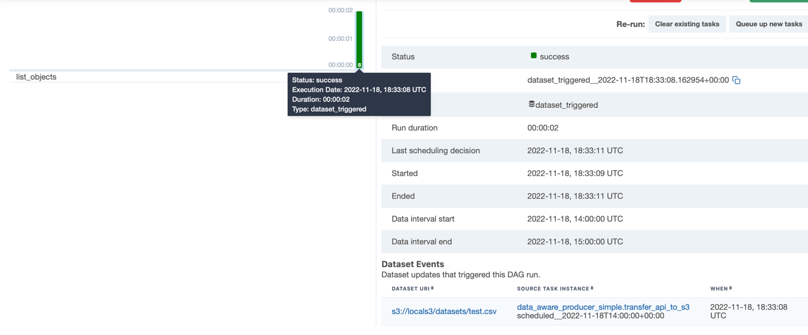
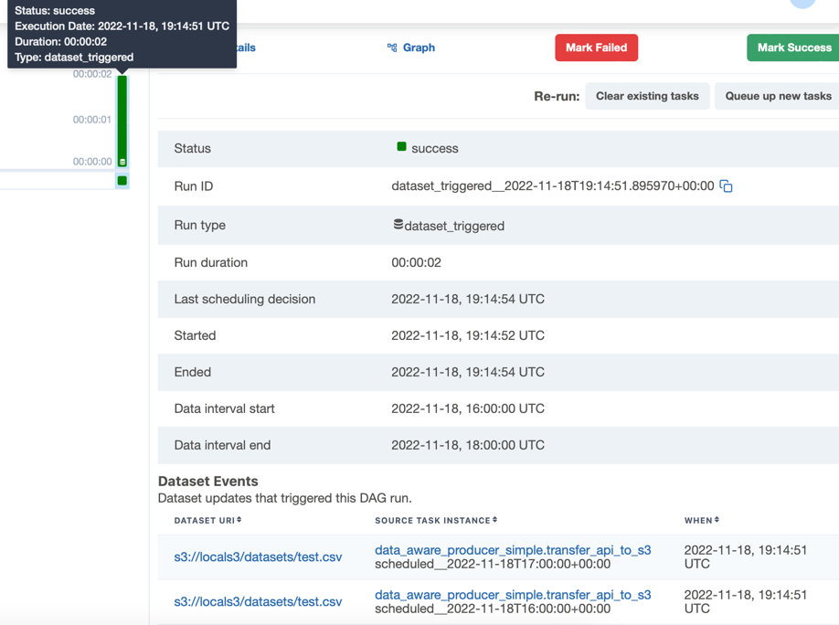
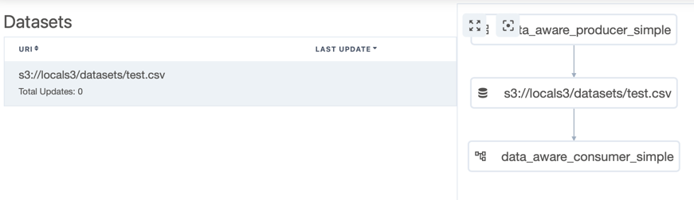
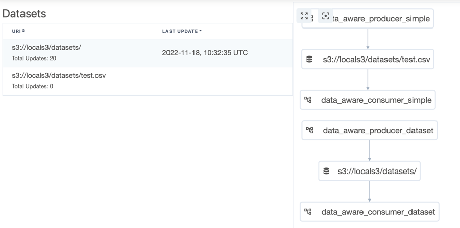
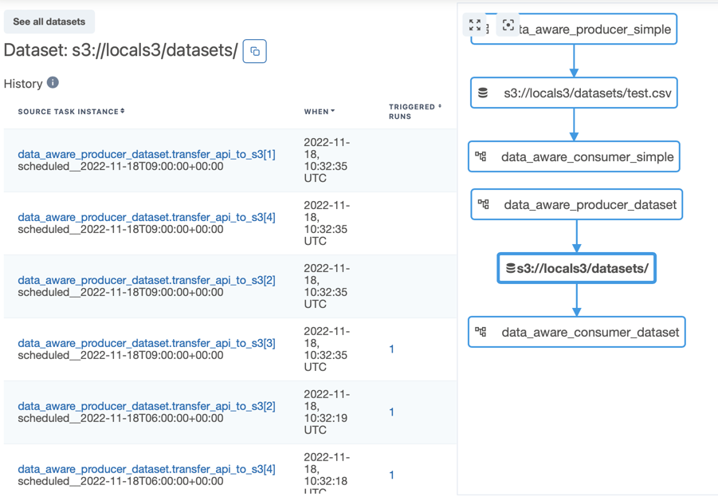
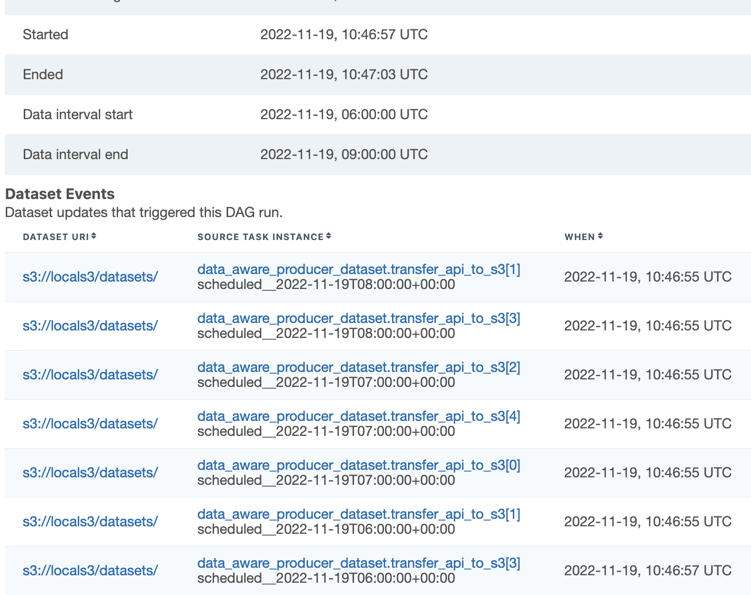

# Airflow 2.4 new features

This subdirectory covers some features introduced in Airflow
2.4. 

These include:
- [x] Data-aware (data-driven) scheduling
- [X] Various minor features:
  - [x] Consolidated schedule parameter
  - [x] Auto-register DAG used in context manager

I've also wrote a short story on Medium related to
data-aware scheduling. You can find it [here](https://medium.com/@MarinAgli1/a-look-into-airflow-data-aware-scheduling-and-dynamic-task-mapping-8c548d4ad79).

# Data-aware (data-driven) scheduling

Airflow version 2.4 introduces the ability to schedule
DAGs based on a task updating a dataset. The current
feature release is a foundation for future plans.
Also, in all the examples I use `catchup=True`. However,
the feature was probably not designed with backfilling
in mind. 

Let's start with the first example. Take a look at the 
`dags > data_aware_scheduling_simple.py` file.

First we define a dataset:
```python
wildfires_dataset = Dataset("s3://locals3/datasets/test.csv")
```

A dataset represents a logical grouping of data. 
It is represented by an URI. The URI scheme **must not** 
contain the string `airflow`, which is reserved for 
the future. It also needs to be a valid URI.

The current version of Airflow treats the URI as a string and doesn't
recognise file glob patterns or regular expressions.

The task that will change the dataset needs to register
this using the `outlet` parameter. The task in the producer
DAG is defined:
```python
transfer_from_api_to_s3 = PythonOperator(
    task_id="transfer_api_to_s3",
    python_callable=_transfer_from_api_to_s3,
    op_kwargs={
        "s3_conn_id": "locals3",
        "api_conn": "wildfires_api",
        "args": {"limit": 1000},
        "bucket": "datasets",
        "endpoint": "api/sample",
        "key": "test.csv",
    },
    outlets=[wildfires_dataset],
)
```

And the consumer DAG registers its schedule to be the 
defined dataset. 
```python
with DAG(
    dag_id="data_aware_consumer_simple",
    description="This dag demonstrates a simple dataset consumer",
    start_date=pendulum.now().subtract(hours=int(os.environ["HOURS_AGO"])),
    schedule=[wildfires_dataset],
    tags=["airflow2.4", "dataset-consumer"],
):
...
```

Note that when running this simple example, the producer 
will run 4 times for catchup (backfill), but the 
consumer will run only once. This might not always be the
case. It may have been run more than once.
If you manually trigger the producer again, 
the consumer will also run after the producer finishes.

There is some non-determinism here. For starters, 
during backfill it is unclear for which dag run
the task from `data_aware_producer_simple` DAG will 
trigger the consumer. It is possible that tasks from
multiple DAG runs end-up triggering the consumer. 

Looking at the run details for the `data_aware_consumer_simple`DAG, you'll notice that it 
has a Data interval. This Data interval depends on which
DAG runs triggered the consumer.



Here is the result after removing the docker containers 
and volumes a few times: 


As you can see, in this case, two producer DAG runs
(or rather the tasks in those runs) triggered the
consumer DAG run. Now, the Data interval is the 
combination of the interval of the two runs that
triggered it. 

This is probably due to multiple parallel runs of the
`data_aware_consumer_simple` DAG.

You can view the relationship between the datasets and
DAGs in the webserver UI under the Datasets tab. 



I advise caution when starting DAGs and sharing datasets
between DAGs. This is what happened to me when I first
started the producer, waited a bit, and then started
the consumer:

Additionally, if another DAG is also scheduled on the
same dataset, and you unpause it after the producer
has finished, the DAG will be triggered once.


## Second example
The second example uses a combination of Dynamic Task
Mapping (Ariflow 2.3 feature) and data aware scheduling.
In this example, the dataset is defined as:
```python
wildfires_dataset = Dataset("s3://locals3/datasets/")
```

and will capture all the changes in the bucket. 

However, I found an interesting thing while doing this.
First, when I started the producer, 3 runs finished 
before the consumer was triggered. And the 4th producer
run also triggered the consumer run. 

Furthermore, by looking at the Datasets tab and selecting
the appropriate dataset, you can see which tasks
triggered the run from the consumer. 
E.g. when I selected the first element from this list:

I got the following:



As we can see, not all the instances of the task
triggered a DAG run. Furthermore, it is unclear which
task instances from which DAG run will trigger the
consumer DAG:


In this view, you can see which 
runs triggered the consumer. Also, it also seems that
it could be a bad idea to do something like this in
production. Perhaps there should exist a task after
all the mapped instances have finished that should
actually trigger the consumer.

It also seems that it could be a bad idea to do 
something like this in production. Perhaps there should
exist a task after all the mapped instances have 
finished that should actually trigger the consumer. 
I added an example for this that uses the `EmptyOperator`.

It is also possible to assign the `outlets` parameter
a single dataset, and not an array. Be careful if you
do this by accident. The docs do not mention this.

The docs also state that it is possible to use multiple
datasets with a dag.
A DAG whose schedule uses multiple datasets will be run
only when all of the datasets were updated. That means
that some datasets may be updated multiple times 
by the producer before the consumer is run. 

## Key takeaways
The key takeaways from this are:
1. datasets are treated as URIs and Airflow doesn't 
check the content of the dataset; 
2. dataset URI's have some limitations - they have to 
be a valid URI and the schema cannot contain the word 
airflow;
3. you cannot use regular expressions and blob patterns 
to create multiple datasets, but you can define a 
bucket as a dataset; 
4. be careful when backfilling or running multiple DAG 
runs of a data producer in parallel - Airflow doesn't 
guarantee to which DAG run the task that triggers the 
consumer belongs. Airflow also doesn't guarantee that 
you will have the same number of consumer schedules 
as that of the producer;
5. to be fair, the data-aware scheduling feature probably 
wasn't designed to handle backfilling; 
6. when using dynamic task mapping, any task instance, 
or combination of task instances can schedule/trigger 
the consumer to run; 
7. design pipelines and dataset dependencies between them with care.

# Minor features

Here we mention a few nice minor features.

## Consolidated schedule parameter
Airflow has a number of parameters to schedule DAG runs.
These include `schedule_interval`, `timetable` and 
`schedule`. The parameters `schedule_interval` and `timetable`
are being deprecated in favour of the `schedule` 
parameter [4].

The examples contain schedules set to cron expressions
and datasets.

## Auto-register DAG used in context manager
Since version 2 (I think) of Airflow, it is possible
to declare DAGs using a context manager.
E.g.
```python
with DAG(dag_id="example") as dag:
  ...
```

From version 2.4, DAGs declared using context managers
are auto-registered and you can omit the `as dag` part.
This behaviour can be turned off for a DAG. 

See [here](https://airflow.apache.org/blog/airflow-2.4.0/#auto-register-dags-used-in-a-context-manager-no-more-as-dag-needed).

All the examples use this new feature.

# References
1. https://airflow.apache.org/docs/apache-airflow/stable/concepts/datasets.html
2. https://airflow.apache.org/blog/airflow-2.4.0/
3. https://airflow.apache.org/blog/airflow-2.4.0/#auto-register-dags-used-in-a-context-manager-no-more-as-dag-needed
4. https://www.astronomer.io/blog/apache-airflow-2-4-everything-you-need-to-know/
