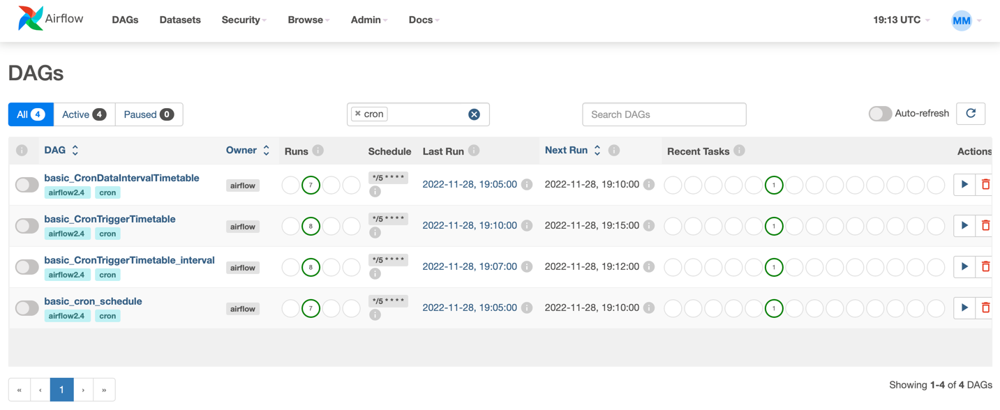

# Airflow 2.4 new features

This subdirectory covers some features introduced in Airflow
2.4. 

These include:
- [x] Data-aware (data-driven) scheduling
- [x] CronTriggerTimetable vs CronDataIntervalTimetable (varios cron schedules)
- [X] Various minor features:
  - [x] Consolidated schedule parameter
  - [x] Auto-register DAG used in context manager

I've also wrote a short story on Medium related to
data-aware scheduling. You can find it [here](https://medium.com/@MarinAgli1/a-look-into-airflow-data-aware-scheduling-and-dynamic-task-mapping-8c548d4ad79).

# Data-aware (data-driven) scheduling

Airflow version 2.4 introduces the ability to schedule
DAGs based on a task updating a dataset. The current
feature release is a foundation for future plans.
Also, in all the examples I use `catchup=True`. However,
the feature was probably not designed with backfilling
in mind. 

Let's start with the first example. Take a look at the 
`dags > data_aware_scheduling_simple.py` file.

First we define a dataset:
```python
wildfires_dataset = Dataset("s3://locals3/datasets/test.csv")
```

A dataset represents a logical grouping of data. 
It is represented by an URI. The URI scheme **must not** 
contain the string `airflow`, which is reserved for 
the future. It also needs to be a valid URI.

The current version of Airflow treats the URI as a string and doesn't
recognise file glob patterns or regular expressions.

The task that will change the dataset needs to register
this using the `outlet` parameter. The task in the producer
DAG is defined:
```python
transfer_from_api_to_s3 = PythonOperator(
    task_id="transfer_api_to_s3",
    python_callable=_transfer_from_api_to_s3,
    op_kwargs={
        "s3_conn_id": "locals3",
        "api_conn": "wildfires_api",
        "args": {"limit": 1000},
        "bucket": "datasets",
        "endpoint": "api/sample",
        "key": "test.csv",
    },
    outlets=[wildfires_dataset],
)
```

And the consumer DAG registers its schedule to be the 
defined dataset. 
```python
with DAG(
    dag_id="data_aware_consumer_simple",
    description="This dag demonstrates a simple dataset consumer",
    start_date=pendulum.now().subtract(hours=int(os.environ["HOURS_AGO"])),
    schedule=[wildfires_dataset],
    tags=["airflow2.4", "dataset-consumer"],
):
...
```

Note that when running this simple example, the producer 
will run 4 times for catchup (backfill), but the 
consumer will run only once. This might not always be the
case. It may have been run more than once.
If you manually trigger the producer again, 
the consumer will also run after the producer finishes.

There is some non-determinism here. For starters, 
during backfill it is unclear for which dag run
the task from `data_aware_producer_simple` DAG will 
trigger the consumer. It is possible that tasks from
multiple DAG runs end-up triggering the consumer. 

Looking at the run details for the `data_aware_consumer_simple`DAG, you'll notice that it 
has a Data interval. This Data interval depends on which
DAG runs triggered the consumer.

<p align="center">

</p>

Here is the result after removing the docker containers 
and volumes a few times: 

<p align="center">

</p>

As you can see, in this case, two producer DAG runs
(or rather the tasks in those runs) triggered the
consumer DAG run. Now, the Data interval is the 
combination of the interval of the two runs that
triggered it. 

This is probably due to multiple parallel runs of the
`data_aware_consumer_simple` DAG.

You can view the relationship between the datasets and
DAGs in the webserver UI under the Datasets tab. 

<p align="center">

</p>

I advise caution when starting DAGs and sharing datasets
between DAGs. This is what happened to me when I first
started the producer, waited a bit, and then started
the consumer:

Additionally, if another DAG is also scheduled on the
same dataset, and you unpause it after the producer
has finished, the DAG will be triggered once.


## Second example
The second example uses a combination of Dynamic Task
Mapping (Ariflow 2.3 feature) and data aware scheduling.
In this example, the dataset is defined as:
```python
wildfires_dataset = Dataset("s3://locals3/datasets/")
```

and will capture all the changes in the bucket. 

However, I found an interesting thing while doing this.
First, when I started the producer, 3 runs finished 
before the consumer was triggered. And the 4th producer
run also triggered the consumer run. 

Furthermore, by looking at the Datasets tab and selecting
the appropriate dataset, you can see which tasks
triggered the run from the consumer. 
E.g. when I selected the first element from this list:

<p align="center">

</p>

I got the following:

<p align="center">

</p>

As we can see, not all the instances of the task
triggered a DAG run. Furthermore, it is unclear which
task instances from which DAG run will trigger the
consumer DAG:

<p align="center">

</p>

In this view, you can see which 
runs triggered the consumer. Also, it also seems that
it could be a bad idea to do something like this in
production. Perhaps there should exist a task after
all the mapped instances have finished that should
actually trigger the consumer.

It also seems that it could be a bad idea to do 
something like this in production. Perhaps there should
exist a task after all the mapped instances have 
finished that should actually trigger the consumer. 
I added an example for this that uses the `EmptyOperator`.

It is also possible to assign the `outlets` parameter
a single dataset, and not an array. Be careful if you
do this by accident. The docs do not mention this.

The docs also state that it is possible to use multiple
datasets with a dag.
A DAG whose schedule uses multiple datasets will be run
only when all of the datasets were updated. That means
that some datasets may be updated multiple times 
by the producer before the consumer is run. 

## Key takeaways
The key takeaways from this are:
1. datasets are treated as URIs and Airflow doesn't 
check the content of the dataset; 
2. dataset URI's have some limitations - they have to 
be a valid URI and the schema cannot contain the word 
airflow;
3. you cannot use regular expressions and blob patterns 
to create multiple datasets, but you can define a 
bucket as a dataset; 
4. be careful when backfilling or running multiple DAG 
runs of a data producer in parallel - Airflow doesn't 
guarantee to which DAG run the task that triggers the 
consumer belongs. Airflow also doesn't guarantee that 
you will have the same number of consumer schedules 
as that of the producer;
5. to be fair, the data-aware scheduling feature probably 
wasn't designed to handle backfilling; 
6. when using dynamic task mapping, any task instance, 
or combination of task instances can schedule/trigger 
the consumer to run; 
7. design pipelines and dataset dependencies between them with care.

## CronTriggerTimetable vs CronDataIntervalTimetable (varios cron schedules)

**NOTE** The Grid view on the UI causes confusion
when pausing and unpausing DAGs, so please 
[read the docs first](https://airflow.apache.org/docs/apache-airflow/stable/concepts/timetable.html#the-time-when-a-dag-run-is-triggered).

For defining cron schedules, there are basically three 
options:
1. standard cron expression that you're probably used to;
2. `CronDataIntervalTimetable`;
3. `CronTriggerTimetable`

To begin with, there are 4 DAGs for demonstration 
(there are 2 for`CronTriggerTimetable`). All of the DAGs
are located in the `cron_schedules_dags` file. 
All of the dags have the same cron expression:
`"*/5 * * * *"`, which translated means "every 5 minutes".

All of the DAGs have their start_date set to 
15 minutes before `now()`. 

I turned on the DAGs at **22:17** (local time) and this 
happened:

<p align="center">

</p>


As we can see, 2 of the DAGs started twice, and 2 appear
to have started three times (for backfill/catchup). 
However, only `CronTriggerTimetable` was actually
executed three times.

Let's take a look at the DAGs.

The first twouse the basic cron expression(basic_cron) 
and `CronDataIntervalTimetable` timetable 
(basic_CronDataIntervalTimetable). 
Let's take a look at the start and end times of their 
**first dag runs**:
1. cron schedule

| Property            | Time                     |
|---------------------|--------------------------|
| Data interval start | 2022-11-28, 21:05:00 UTC |
| Data interval end   | 2022-11-28, 21:10:00 UTC |


2. CronDataIntervalTimetable 

| Property            | Time                     |
|---------------------|--------------------------|
| Data interval start | 2022-11-28, 21:05:00 UTC |
| Data interval end   | 2022-11-28, 21:10:00 UTC |

The start and intervals are the same, as are the
logical dates (both are):
2022-11-28 21:05:00.

Ok, now for the other CronTriggerTimetable DAGs
1. CronTriggerTimetable

| Property            | Time                     |
|---------------------|--------------------------|
| Data interval start | 2022-11-28, 21:05:00 UTC |
| Data interval end   | 2022-11-28, 21:05:00 UTC |                          |

The logical date for the first run is also: 
2022-11-28, 21:05:00 UTC.

The CronTriggerTimetable with interval DAG looks
like it started three times. It didn't, or at least
the operators didn't. here is the breakdwon:
1. actually executed

| Property            | Time                     |
|---------------------|--------------------------|
| Data interval start | 2022-11-28, 21:07:00 UTC |
| Data interval end   | 2022-11-28, 21:10:00 UTC |                          |

The logical date: 2022-11-28, 21:07:00 UTC.

2. displayed but the operator wasn't executed

| Property            | Time                     |
|---------------------|--------------------------|
| Data interval start | 2022-11-28, 21:02:00 UTC |
| Data interval end   | 2022-11-28, 21:05:00 UTC |

We can confirm that the first run is only displayed,
but not executed by looking at the Graph view:

<p align="center">

</p>


What's interesting is the data interval for the 
`basic_CronTriggerTimetable_interval` DAG. The interval
set to the timetable is 3 minutes. So the data interval
seems to have been moved by 3 minutes before the 
21:05. 

The documentations says that if we define the interval
for the `CronTriggerTimetable`, the data interval for 
a dag run will span from the _specified_trigger_time_ - 
_interval_ to the _specified_interval_time_.
In this case the data intervals for the 
`basic_CronTriggerTimetable_interval` DAG will be:
1. start: every 5 minutes - 3 minutes
2. end: every 5 minutes

If we don't specify the interval, the start and end
data intervals will be the same (as can be seen 
by the `basic_CronTriggerTimetable` DAG's runs).

The `CronDataIntervalTimetable` demonstrated by the
`basic_CronDataIntervalTimetable` DAG will have
the start and end time of the data interval always
in the range of 5 minutes. More generally, this 
timetable creates data intervals according to the
interval between each cron trigger point. **It also
triggers the DAG to run at the end of each.** This
also seems to be the case for the `basic_cron` example.

On the other hand, the `CronTriggerTimetable` timetable
triggers the DAG to run when the `data_interval_start`,
`data_interval_end`, and `logical_date` are the same,
unless the interval is specified. If the interval is 
specified, the `logical_date` will be the same as the
`data_interval_start`.

## Pausing and unpausing the DAGs

For this step, I paused the DAGs at **22:21** local
time (21:21 UTC):

<p align="center">

</p>

and waited some time. After about some 30 minutes, I
unpaused the DAGs again. It was around **22:51** local
time, and the result was:

<p align="center">

</p>

I immediately stopped the DAGs at this point to investigate
the data intervals. 

We can see that we got 2 new runs for the 
`basic_cron_schedule` and `basic_CronDataIntervalTimetable`
DAGs. However, we got 6 (? **pay attention**) 
new runs for the`basic_CronTriggerTimetable` and 
`basic_CronTriggerTimetable_interval` DAGs. 

The first new run for the schedule and `basic_CronDataIntervalTimetable`
DAGs has:
- data interval start: 2022-11-28, 21:40:00 UTC
- data interval end: 2022-11-28, 21:45:00 UTC

Their second run has:
- data interval start: 2022-11-28, 21:45:00 UTC
- data interval end: 2022-11-28, 21:50:00 UTC

So, the DAG runs with start 21:20 up to start 21:35 are
skipped. That's 4 DAG runs. 

The other two DAGs that use `CronTriggerTimetable` 
**seemed to have** backfilled all of the missing runs 
between the pause and unpause. Indeed, you can
select the DAG run on the grid view and get the details
like start and end intervals (see next image below). 

However, the operator was actually executed for only
3 DAG runs. 

<p align="center">

</p>

If you look at the image above, there are 3 runs that
executed the operator (the last 3). The other runs
show the data interval as the DAG was ran, except,
that the operator has a missing status. This means
that the operator wasn't actually executed. The same
is for `basic_CronTriggerTimetable`.

For the `basic_CronTriggerTimetable`DAG, 
the first **new actual** DAG run has the following 
intervals:
- data interval start: 2022-11-28, 21:40:00 UTC
- data interval end: 2022-11-28, 21:40:00 UTC
- logical date: 2022-11-28, 21:40:00 UTC

and the last **actual** run:
- data interval start: 2022-11-28, 21:50:00 UTC
- data interval end: 2022-11-28, 21:50:00 UTC
- logical date: 2022-11-28, 21:50:00 UTC

The other one, the `basic_CronTriggerTimetable_interval`
DAG, the first **new actual** DAG run has the following 
intervals:
- data interval start: 2022-11-28, 21:37:00 UTC
- data interval end: 2022-11-28, 21:40:00 UTC
- logical date: 2022-11-28, 21:37:00 UTC

and for the last **actual** DAG run:
- data interval start: 2022-11-28, 21:47:00 UTC
- data interval end: 2022-11-28, 21:50:00 UTC
- logical date: 2022-11-28, 21:47:00 UTC


What's interesting when using `CronTriggerTimetable`
is that the operator's state isn't present in the
grid view for several of the _backfill DAG runs. 

<p align="center">

</p>

If we look at the details, the run id is:
scheduled__2022-11-28T21:25:00+00:00.

Let's take a look at the graph to confirm that the
operator was not executed:

<p align="center">

</p>

## Pausing/unpausing DAGs with static start_date

A colleague suggested that the issue that occurs when
pausing/unpausing DAGs might be because of the dynamic
start date used in the initial examples. He also provided
links to stackoverflow regarding dynamic start date
(see references 6 and 7).

Therefore I added four more DAGs that use a static
start date. The lines are commented out so that
the DAGs do not run a large number of times when
starting the DAGs in the future. I suggest you adjust
the start date to your requirements.

I started the DAGs on December 22nd sometime after 
17:00 UTC. Then I paused the DAGs around 17:15 UTC.

<p align="center">

</p>

I unpaused the DAGs around 17:31 UTC. This happened:

<p align="center">

</p>

Seems like nothing has changed. However, looking at one
of the DAGs:

<p align="center">

</p>

we can see that all of the runs executed all of the operators
after unpause.
This is also the only DAG whose first instance of the
DAG run shows that the operator was not executed.
Let's take a look at the details of the first run:

<p align="center">

</p>

If we take a look at the Data interval start it is 16:57,
and data interval end is 17:00. However, Airflow should 
schedule the first DAG run to start at the end of
`start_date + interval`. This explains why the operator
wasn't executed. However, it still doesn't explain
why the DAG run was added to the UI.

## Summary

Honestly, it is clear to me that the data intervals 
are different between the two timetables and that
the basic schedule acts as the 
`CronDataIntervalTimetable`, but this behaviour with
backfilling and pausing/unpausing DAGs is confusing
(and is caused by dynamic start date).

Again, I suggest that you read the [docs](https://airflow.apache.org/docs/apache-airflow/stable/concepts/timetable.html#the-time-when-a-dag-run-is-triggered).

## The DAGs' definitions

Here are the DAG definitions:
```python
with DAG(
    dag_id="basic_cron_schedule",
    start_date=pendulum.now().subtract(minutes=MINUTES_AGO),
    schedule="*/5 * * * *",
    description="A simple DAG to demonstrate cron schedule",
    tags=["airflow2.4", "cron"],
):
    cron_op = PythonOperator(
        task_id="print_data_interval", python_callable=_print_data_interval
    )


with DAG(
    dag_id="basic_CronDataIntervalTimetable",
    start_date=pendulum.now().subtract(minutes=MINUTES_AGO),
    schedule=CronDataIntervalTimetable("*/5 * * * *", timezone="UTC"),
    description="A simple DAG to demonstrate CronDataIntervalTimetable",
    tags=["airflow2.4", "cron"],
):
    data_interval_timetable_op = PythonOperator(
        task_id="print_data_interval", python_callable=_print_data_interval
    )

with DAG(
    dag_id="basic_CronTriggerTimetable",
    start_date=pendulum.now().subtract(minutes=MINUTES_AGO),
    schedule=CronTriggerTimetable("*/5 * * * *", timezone="UTC"),
    description="A simple DAG to demonstrate CronTriggerTimetable",
    tags=["airflow2.4", "cron"],
):
    trigger_timetable_op = PythonOperator(
        task_id="print_data_interval", python_callable=_print_data_interval
    )

with DAG(
    dag_id="basic_CronTriggerTimetable_interval",
    start_date=pendulum.now().subtract(minutes=MINUTES_AGO),
    schedule=CronTriggerTimetable(
        "*/5 * * * *", timezone="UTC", interval=timedelta(minutes=3)
    ),
    description="A simple DAG to demonstrate CronTriggerTimetable with inteval",
    tags=["airflow2.4", "cron"],
):
    trigger_timetable_with_interval_op = PythonOperator(
        task_id="print_data_interval", python_callable=_print_data_interval
    )
```

# Minor features

Here we mention a few nice minor features.

## Consolidated schedule parameter
Airflow has a number of parameters to schedule DAG runs.
These include `schedule_interval`, `timetable` and 
`schedule`. The parameters `schedule_interval` and `timetable`
are being deprecated in favour of the `schedule` 
parameter [4].

The examples contain schedules set to cron expressions
and datasets.

## Auto-register DAG used in context manager
Since version 2 (I think) of Airflow, it is possible
to declare DAGs using a context manager.
E.g.
```python
with DAG(dag_id="example") as dag:
  ...
```

From version 2.4, DAGs declared using context managers
are auto-registered and you can omit the `as dag` part.
This behaviour can be turned off for a DAG. 

See [here](https://airflow.apache.org/blog/airflow-2.4.0/#auto-register-dags-used-in-a-context-manager-no-more-as-dag-needed).

All the examples use this new feature.

# References
1. https://airflow.apache.org/docs/apache-airflow/stable/concepts/datasets.html
2. https://airflow.apache.org/blog/airflow-2.4.0/
3. https://airflow.apache.org/blog/airflow-2.4.0/#auto-register-dags-used-in-a-context-manager-no-more-as-dag-needed
4. https://www.astronomer.io/blog/apache-airflow-2-4-everything-you-need-to-know/
5. https://airflow.apache.org/docs/apache-airflow/stable/concepts/timetable.html#the-time-when-a-dag-run-is-triggered
6. https://stackoverflow.com/questions/57096386/why-does-airflow-changing-start-date-without-renaming-dag
7. https://stackoverflow.com/questions/41134524/why-is-it-recommended-against-using-a-dynamic-start-date-in-airflow
